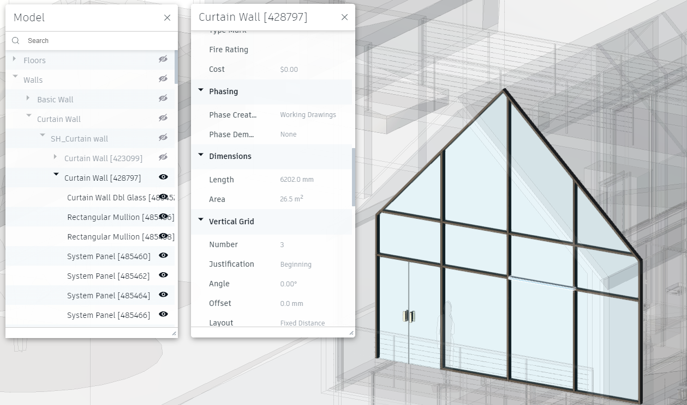

# LMV-QL
LMV-QL is a query language for filtering model elements in [Autodesk Platform Services (formerly Forge) viewer](https://aps.autodesk.com/en/docs/viewer/v7/developers_guide/overview/)

> Check out our [demo application](https://lmv-ql.cadbim.dev) with a sample viewer extension
> which allows to run several predefined LMV-QL filters and also allows you
> to test you own filters on the basic sample model

## Usage

### Quick tour
- install the package: `npm install lmv-ql`
- import query:
```ts
import { query } from "lmv-ql";
```
- run your LMV query
```ts
const filterOptions = {
  displayUnits: viewer.prefs.get(Autodesk.Viewing.Private.Prefs.DISPLAY_UNITS),
  displayUnitsPrecision: viewer.prefs.get(Autodesk.Viewing.Private.Prefs.DISPLAY_UNITS_PRECISION)
};

const queryResults = await query(viewer.model, lmvQuery, filterOptions);

if (!queryResults.error) {
  const dbIds = queryResults.dbIds;
  // do whatever you want with the elements db ids returned by filter engine
}
```
### Introduction
#### Simple filters
LMV-QL designed to make filters on model element properties. Let's imagine we want to make a simple filter for model floors with specified `Area` property value.


There are several possible options to that, depending on what you need:
- you can provide exact path:
`Floors.Floor.[Generic 150mm].Floor.Area = 105.9`
In that case LMV-QL would search elements only inside that subtree (Floors -> Floor -> Generic 150mm -> Floor)
- you can replace any path of your query with `*` symbol:
`*.Floor.Area = 105.9`
- or even search among all elements of your model like:
`*.Area = 105.9`
But what if some other element of your model has `Area` property and it's value is 105.9 squared meters and you want to searcg only among floors? Then use something like that:
`Floors.*.Area = 105.9`
- or maybe you want to query all elements which areas are more than 50 square meters?
`*.Area > 50`

#### Complex filters
LMV-QL designed to be able to make queries on models with a complex structure. Let's say, we want to query rectangular mullions from specific curtain wall from [Revit sample file](https://lmv-ql.cadbim.dev)

The main problem is that we need to check properties from different levels of hierarch of the model tree. To do that with LMV-QL we should use logical operators. 

First of all we need to distinguish curtain walls [from our model](https://lmv-ql.cadbim.dev). We can do that by dimensions:


So we are ready to write the first part of our filter:

`*.[Curtain Wall].Length = 6202 and *.[Curtain Wall].Area = 26.5`

Then we need to distinguish rectangular mullions from other curtain wall components. We can do that by checking `Type Name` property. If it ends with "rectangular", then we found our mullion object:


So, let's add this to our filter:
`*.[Curtain Wall].Length = 6202 and *.[Curtain Wall].Area = 26.5 && *.[Type Name] like "%rectangular"`

and check it:


#### Units

LMV-QL follows the same rules of formatting and values comparison as Autodesk Platform Services viewer does. You can provide `displayUnits` and `displayUnitsPrecision` in the options object when you perform your query like
```ts
const filterOptions = {
  displayUnits: viewer.prefs.get(Autodesk.Viewing.Private.Prefs.DISPLAY_UNITS),
  displayUnitsPrecision: viewer.prefs.get(Autodesk.Viewing.Private.Prefs.DISPLAY_UNITS_PRECISION)
};

const queryResults = await query(viewer.model, lmvQuery, filterOptions);
```
So user can copy numerical values from properties panel directly to the filter query string: `*.Floor.Area = 38.5`


However, if we change precision, we also need to fix the filter string: `*.Floor.Area = 38.46`


If we are changing display units, then we also should adjust the filter string: `*.Floor.Area = 413.98`


### Filter language

#### Identificators: hierarchy and element property definition 

You need to join with `.` symbol model tree item names and property into a single string To define LMV-QL hierarchy position and property, e.g. `SomeCategory.SomeSubCategory.SomeProperty`. If your item or property name contains spaces or dots `.` symbols, then put it inside `[` and `]` symbols like `Floors.Floor.[Generic 150mm].Floor.Area`

You can replace any part of the hierarchy path with `*` (except the latest), which would mean `any` in that case
Valid identificators:
- `Floors.Floor.[Generic 150mm].Floor.Area`
- `Floors.*.Area`
- `*.Area`

`Floors.*` - not valid, e.g. any property is not supported

#### Elements in hierarchy filters

You can provide a valid identificator with following `!` sign to filter all sub items from model tree. Valid filters:
- `[Plumbing Fixtures]!`
- `Walls.[Curtain Wall]!`
- `Walls.[Curtain Wall].[SH_Curtain wall].[Curtain Wall].[System Panel]!`

`Walls.*!` is not a valid filter

#### Simple filters by property value

##### Numerical properties

- property value equal to `identificator = value`:
`Walls.[Basic Wall].*.Width = 300`
- greater than value `identificator > value`:
`*.Floor.Area > 100`
- greater than or equal to value `identificator >= value`
`*.Floor.Area >= 100`
- less than value `identificator < value`
`*.Floor.Area < 100`
- less than or equal to value `identificator <= value`:
`*.Floor.Area <= 100`
- property not equal to value `identificator <> value` or `identificator != value`. Both options are valid:
`*.Floor.Area <> 9` or `*.Floor.Area != 9`

##### String properties

- property value equal to `identificator = value`:
`*.Mark = "207"`
- property value not equal to `identificator <> value` or `identificator != value`. Both options are valid:
`*.Mark <> "205"` or `*.Mark != "205"`
- property value starts with `identificator like "start text%"`:
`*.name like "RPC%"`
- property value ends with `identificator like "%-some further text"`:
`*.name like "%- 300mm Concrete"`

If you want to include a text with quotes like `some "value" of something` then you need to escape quotes with `\` sign:
`category.element.property = "some \"value\" of something"`

If you want to include `%` sign into `like` expression you also need to escape it with `\` sign:
`category.element.property like "%some \% of something"`

##### IN / NOT IN
Currently not supported. Upcoming...

#### Logical filters

##### AND operator

LMV-QL allows to define `AND` filter as:
- `and` (case insensitive)
- `&&`
- `&`

Valid `and` filters samples:
- `Windows! and *.Level = "Level 1 Living Rm."`
- `Walls.[Curtain Wall].*.[Assembly Code] = "B2020200" 
&& *.[Type Name] = "64 x 128 rectangular"`

##### OR operator
LMV-QL allows to define `OR` filter as:
- `or` (case insensitive)
- `||`
- `|`

Valid `or` filters samples:
- `*.Mark = "207" or *.Mark = "204"`
- `*.Level = "Level 1" || *.Level = "Level 1 Living Rm."`

##### NOT operator
Currently not supported. Upcoming...

##### Brackets

LMV-QL allows to combine filters using brackets. Example:
- `Windows! and (*.Level = "Level 1 Living Rm."
or *.name = "M_Skylight")`